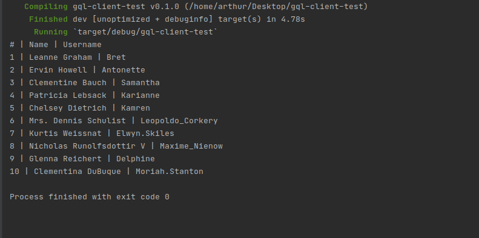

- [Intro](#intro)
- [Setup](#setup)
- [Preparing Query](#preparing-query)
- [Fetching and Displaying Data](#fetching-and-displaying-data)
- [Conslusion](#conslusion)


## Intro

In this tutorial-style article, I'm going to show you how to use [gql_client](https://crates.io/crates/gql_client) crate for making requests to GraphQL APIs from your rust application. 

We will use [GraphQLZero](https://graphqlzero.almansi.me/) - fake, online API for testing requests. I also assume that you already have rust installed (If not, just use [rustup](https://rustup.rs/)), you understand the basics of the [language](/how-to-rustup) and its [asynchronous](https://rust-lang.github.io/async-book/) programming concepts.

As a result, we will build a simple application that fetches the user list from API and outputs it in the console. 

## Setup

So let's go ahead and set up a new cargo project!

First of all, create a new binary application. 

```bash
cargo new gql-client-test && cd gql-client-test
```  

Then add the following dependencies in Cargo.toml file and let's talk about them a bit.

```toml
[dependencies]
gql_client = "0.2.1"
serde = { version = "1.0", features = ["derive"] }
tokio = { version = "0.2", features = ["full"] }
```

- **serde** - Though the work related to JSON is done internally by [reqwest](https://crates.io/crates/reqwest) we will still need derive feature of serde to make our structs compatible for serialization and deserialization.

- **tokio** - Tokio will serve as our runtime for asynchronous code execution. Though there are a lot of other implementations of futures we will go by the standard choice in our example.

As a final step of our setup, we will replace the main function with one written below to mark an entry point for tokio to execute. So go ahead and paste this in the **src/main.rs** file.

```rust
#[tokio::main]
async fn main() -> Result<(), Box<dyn std::error::Error>> {
  Ok(())
}
```

## Preparing Query

Before making a request let's construct query string and data structures for mapping response data. In our case, we will query the list of users and 3 data fields for each - id, name, and username.

```rust
#[tokio::main]
async fn main() -> Result<(), Box<dyn std::error::Error>> {
  // Add this code in main function
  let query = "
    query UserListQuery {
      users {
        data {
          id
          name
          username
        }
      }
    }
  ";

  Ok(())
}
```

The next step is creating correct data structures. Each of them will derive Debug and Deserialize traits for respective purposes, also we will make them a bit more predictable using generics (See NodeList\<T\>). As the query method of gql_client returns the contents of the data field, we won't need an additional struct for mapping the whole response.

Let's put the code below at the beginning of the **src/main.rs** file.

```rust
use serde::Deserialize;

#[derive(Deserialize, Debug)]
struct User {
  id: String,
  name: String,
  username: String
}

#[derive(Deserialize, Debug)]
struct Data {
  users: NodeList<User>
}

#[derive(Deserialize, Debug)]
struct NodeList<T> {
  data: Vec<T>
}
```

## Fetching and Displaying Data

Finally, we are ready to perform the query and output data in the console.
Let's start by initiating a GraphQL client instance.

```rust
use serde::Deserialize;
// Add this line under use statement on the top 
use gql_client::Client;

// Add this lines under query str literal in main function
let endpoint = "https://graphqlzero.almansi.me/api";
let client = Client::new(endpoint);
```

Assuming this part was pretty simple, move forward and put the final lines under the client
instantiation code.

```rust
// Add this code under client instantiation code
let response = client.query::<Data>(query).await.unwrap();

println!("# | Name | Username");
for user in &response.users.data {
  println!("{} | {} | {}", user.id, user.name, user.username);
}
```

In the above code, we are telling rust to execute the query which is going to retrieve type Data as a response. In our case we want our program to **panic** in case something wrong happens, so we are just calling **unwrap** to extract the response from Result\<Data, GraphQLError\> enum.

Finally, we can borrow the user list in the for loop and print data in a readable format. If you've done everything correctly you should see something like this in the console output when running **cargo run**. 



## Conslusion

The main goal of this article was to show some abilities of the rust language in web development. As you can see it gives you much more productivity and good development experience while being a lower-level language than ones that are used primarily for the web. 

While being an author of the library we used I urge you to also check other libraries written for this topic (such as [this](https://github.com/graphql-rust/graphql-client)) because you will probably need more advanced features in the future as your project grows.

In case you'll have some opinions or feature requests about the library feel free to open an [issue](https://github.com/arthurkhlghatyan/gql-client-rs/issues) or reach me out in community [chat](https://t.me/rustarmenia).  
